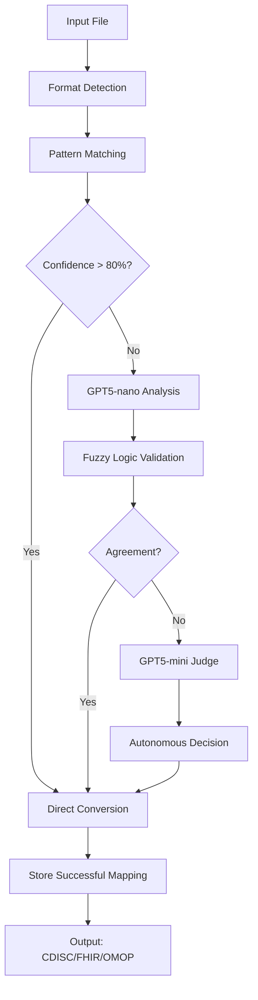

# MCP Tool Design: Autonomous Clinical Schedule Converter

## Executive Summary
A standalone MCP server that provides intelligent, autonomous conversion of clinical trial schedules from any format to standard formats (CDISC SDTM, FHIR, OMOP), with zero human intervention required.

## Problem Statement
Clinical trial schedules come in hundreds of different formats:
- Excel spreadsheets with custom columns
- CSV exports from various EDC systems
- JSON from modern platforms
- PDF protocol documents
- Proprietary formats from CROs

The SoA Optimizer requires a specific format, creating a barrier to adoption. This MCP tool removes that barrier by intelligently converting ANY format to standard formats.

## Core Innovation
- **Dual Validation**: LLM analysis + Fuzzy logic for high confidence
- **Autonomous Arbitration**: GPT5-mini acts as judge when systems disagree
- **Continuous Learning**: Every conversion improves future performance
- **Zero Human Intervention**: System never stops for manual review
- **Standards-Based**: Outputs true CDISC SDTM, FHIR R4, or OMOP CDM
- **Organization Memory**: Learns each org's specific patterns

## Why This Design Is Superior

### LLM + Fuzzy Logic Consensus
Using both approaches provides:
1. **Higher Accuracy**: When they agree, confidence is very high
2. **Error Detection**: Disagreement signals potential issues
3. **Cost Efficiency**: Fuzzy logic handles 80% without LLM costs
4. **Explainability**: Fuzzy provides deterministic reasoning, LLM provides context

### Autonomous Judge
The GPT5-mini judge ensures:
1. **No Workflow Interruption**: System never stops for human input
2. **Consistent Decisions**: Judge uses same criteria every time
3. **Learning Opportunity**: Every decision becomes training data
4. **Audit Trail**: All decisions are logged with reasoning

## Architecture



## Implementation Roadmap

### Phase 1: MVP - CDISC SDTM Converter (Weeks 1-2)

#### Why CDISC SDTM First?
CDISC (Clinical Data Interchange Standards Consortium) SDTM (Study Data Tabulation Model) is:
- **The FDA standard** for clinical trial submissions
- **Universally recognized** in pharmaceutical industry
- **Well-documented** with clear specifications
- **Structured** for easy conversion to other formats

#### Core Components

**1. MCP Server Setup**
```python
# mcp_schedule_converter/server.py
from mcp import MCPServer, tool

class ScheduleConverterServer(MCPServer):
    def __init__(self):
        super().__init__("schedule-converter", "1.0.0", port=8211)
        self.mapping_cache = MappingCache()
        self.pattern_matcher = PatternMatcher()
        self.fuzzy_matcher = FuzzyMatcher()
        self.llm_nano = GPT5Nano()
        self.llm_mini = GPT5Mini()
```

**2. Main Conversion Tool**
```python
@tool(name="convert_schedule", description="Convert clinical schedule to standard format")
async def convert_schedule(
    self,
    file_path: str,
    target_format: str = "CDISC_SDTM",
    organization_id: Optional[str] = None
) -> ConversionResult:

    # Step 1: Check mapping cache for this organization
    if organization_id and (cached := self.mapping_cache.get_org_mappings(organization_id)):
        if cached.confidence > 90:
            return self.apply_cached_conversion(file_path, cached)

    # Step 2: Try pattern matching (fast path - 80% of cases)
    pattern_result = self.pattern_matcher.match(file_path)
    if pattern_result.confidence > 80:
        self.mapping_cache.store_mapping(pattern_result)
        return pattern_result

    # Step 3: GPT5-nano analysis
    nano_result = await self.llm_nano.analyze_structure(file_path)

    # Step 4: Fuzzy logic validation
    fuzzy_result = self.fuzzy_matcher.validate(nano_result)

    # Step 5: Check agreement
    if self.calculate_agreement(nano_result, fuzzy_result) > 85:
        final_result = self.merge_results(nano_result, fuzzy_result)
        self.mapping_cache.store_mapping(final_result)
        return final_result

    # Step 6: GPT5-mini arbitration (autonomous - no human!)
    judge_decision = await self.llm_mini.arbitrate(
        nano_result=nano_result,
        fuzzy_result=fuzzy_result,
        context=self.get_domain_context()
    )

    # Store decision for future learning
    self.mapping_cache.store_mapping(judge_decision)
    return judge_decision
```

**3. LLM Judge Implementation**
```python
class LLMJudge:
    async def arbitrate(self, nano_result, fuzzy_result, context):
        prompt = f"""
        You are a clinical data standards expert judge. Two systems disagree:

        GPT5-nano mapping: {nano_result.mappings}
        Confidence: {nano_result.confidence}

        Fuzzy logic mapping: {fuzzy_result.mappings}
        Confidence: {fuzzy_result.confidence}

        Context: {context}

        DECIDE which is correct. Consider CDISC SDTM compliance.
        Return: decision, confidence, reasoning, learning_point
        """

        decision = await self.llm_mini.complete(prompt)
        self.log_arbitration(decision)  # For monitoring
        return self.create_final_mapping(decision)
```

**4. Mapping Memory System**
```python
class MappingCache:
    def __init__(self):
        self.db = sqlite3.connect("mappings.db")

    def store_mapping(self, org_id: str, source: str, target: str, confidence: float):
        """Store successful mappings for reuse"""

    def get_mapping(self, org_id: str, source: str) -> Optional[Mapping]:
        """Retrieve previous successful mapping"""

    def detect_organization_pattern(self, file_content):
        """Identify org-specific patterns for faster future conversions"""
```

**5. CDISC SDTM Models**
```python
def to_cdisc_sdtm(self, schedule) -> dict:
    """Convert to CDISC SDTM TV (Trial Visits) and PR (Procedures) domains"""

    tv_domain = []  # Trial Visits
    pr_domain = []  # Procedures

    for visit in schedule.visits:
        tv_record = {
            "STUDYID": schedule.study_id,
            "DOMAIN": "TV",
            "VISITNUM": visit.number,
            "VISIT": visit.name,
            "VISITDY": visit.planned_day,
            "TVSTRL": visit.window_before,
            "TVENRL": visit.window_after
        }
        tv_domain.append(tv_record)

        for procedure in visit.procedures:
            pr_record = {
                "DOMAIN": "PR",
                "VISITNUM": visit.number,
                "PRTRT": procedure.name,
                "PRCAT": self.map_to_cdisc_category(procedure.type),
                "PRDUR": procedure.duration
            }
            pr_domain.append(pr_record)

    return {"TV": tv_domain, "PR": pr_domain}
```

### Phase 2: Enhanced Intelligence (Weeks 3-4)

**1. Pattern Recognition Library**
```python
PATTERNS = {
    'date_patterns': [
        (r"Day\s*(\d+)", "simple_day"),
        (r"Week\s*(\d+)\s*Day\s*(\d+)", "week_day"),
        (r"Visit\s*(\d+)", "visit_number"),
        (r"Cycle\s*(\d+)\s*Day\s*(\d+)", "cycle_day")
    ],
    'assessment_mappings': {
        "blood": ["blood_draw", "labs", "phlebotomy"],
        "vitals": ["vital_signs", "vs", "vitals"],
        "imaging": ["ct", "mri", "scan", "x-ray"]
    }
}
```

**2. Fuzzy Matching Engine**
```python
class FuzzyMatcher:
    def match_column(self, column_name: str) -> CDISCMapping:
        # Level 1: Exact match
        if exact := self.exact_match(column_name):
            return exact

        # Level 2: Fuzzy string match
        if fuzzy := self.fuzzy_match(column_name, threshold=85):
            return fuzzy

        # Level 3: Semantic similarity
        if semantic := self.semantic_match(column_name):
            return semantic

        # Level 4: Context-aware
        return self.contextual_match(column_name)
```

**3. Confidence Scoring**
```python
def calculate_confidence(self, mapping: Mapping) -> float:
    factors = {
        'llm_confidence': mapping.llm_score * 0.3,
        'fuzzy_match': mapping.fuzzy_score * 0.3,
        'pattern_match': mapping.pattern_score * 0.2,
        'data_consistency': mapping.consistency * 0.2
    }

    if mapping.llm_agrees_with_fuzzy:
        factors['agreement_bonus'] = 10

    return min(sum(factors.values()), 100)
```

### Phase 3: FHIR Support (Weeks 5-6)

```python
def to_fhir_r4(self, schedule) -> dict:
    """Convert to FHIR R4 CarePlan resource"""

    care_plan = {
        "resourceType": "CarePlan",
        "status": "active",
        "intent": "plan",
        "title": schedule.protocol_name,
        "activity": []
    }

    for visit in schedule.visits:
        activity = {
            "detail": {
                "kind": "Appointment",
                "code": {
                    "coding": [{
                        "system": "http://loinc.org",
                        "code": self.map_to_loinc(visit.type)
                    }]
                },
                "scheduledTiming": {
                    "repeat": {
                        "boundsPeriod": {
                            "start": visit.start_date,
                            "end": visit.end_date
                        }
                    }
                }
            }
        }
        care_plan["activity"].append(activity)

    return care_plan
```

### Phase 4: OMOP CDM Support (Weeks 7-8)

```python
def to_omop_cdm(self, schedule) -> dict:
    """Convert to OMOP Common Data Model"""

    visit_occurrences = []
    procedure_occurrences = []

    for visit in schedule.visits:
        visit_occurrence = {
            "visit_occurrence_id": self.generate_id(),
            "visit_concept_id": self.map_to_omop_concept(visit.type),
            "visit_start_date": visit.date,
            "visit_type_concept_id": 32810  # Clinical trial
        }
        visit_occurrences.append(visit_occurrence)

    return {
        "visit_occurrence": visit_occurrences,
        "procedure_occurrence": procedure_occurrences
    }
```

### Phase 5: Integration (Week 9)

**Integration with SoA Optimizer**
```python
# In schedule-assessments-optimizer/backend/main.py
@app.post("/upload-schedule")
async def upload_schedule(file: UploadFile):
    # Call converter MCP service
    async with MCPClient("http://localhost:8211") as client:
        result = await client.run_tool(
            "convert_schedule",
            {
                "file_path": file.filename,
                "organization_id": current_user.org_id
            }
        )

        # Always proceed (no human review)
        if result.confidence < 85:
            logger.warning(f"Low confidence: {result.confidence}")

        return result.converted_data
```

## Key Features

### Autonomous Operation
- Never stops for human input
- LLM judge makes final decisions
- Logs low-confidence conversions for monitoring

### Learning System
- Stores every successful mapping
- Detects organizational patterns
- Improves with each conversion

### Cost Optimization
- GPT5-nano for initial analysis ($)
- GPT5-mini only for arbitration ($$)
- Pattern matching for 80% of cases (free)
- Caching reduces redundant LLM calls

### Standards Support
- **MVP**: CDISC SDTM (Week 2)
- **Phase 3**: FHIR R4 (Week 6)
- **Phase 4**: OMOP CDM (Week 8)

## Testing Strategy

### Test Data Requirements
- 50+ test files from different sources
- Edge cases (missing columns, unusual formats)
- Real-world clinical trial schedules
- CDISC compliance validation

### Performance Targets
- < 2 seconds for cached conversions
- < 5 seconds for new conversions with LLM
- > 85% average confidence score
- 100% autonomous completion rate

## Detailed Implementation Guide

### Input Format Detection Module

#### Auto-Detection Logic
```python
class FormatDetector:
    def detect_format(self, file_path: str) -> FileFormat:
        # Check file extension
        ext = Path(file_path).suffix.lower()

        # Read first chunk
        with open(file_path, 'rb') as f:
            header = f.read(1024)

        # Detection logic
        if ext in ['.xlsx', '.xls']:
            return self.detect_excel_structure(file_path)
        elif ext == '.csv':
            return self.detect_csv_structure(file_path)
        elif ext == '.json':
            return self.detect_json_structure(file_path)
        elif self._is_xml(header):
            return FileFormat.XML
        elif ext == '.pdf':
            return FileFormat.PDF
        else:
            return self.detect_by_content(header)

    def detect_csv_structure(self, file_path: str):
        # Detect delimiter
        with open(file_path, 'r') as f:
            sample = f.read(2048)

        sniffer = csv.Sniffer()
        delimiter = sniffer.sniff(sample).delimiter

        # Detect headers
        has_header = sniffer.has_header(sample)

        return CSVFormat(delimiter=delimiter, has_header=has_header)
```

### Intelligent Column Mapping

#### Multi-Level Mapping Strategy
```python
class ColumnMapper:
    def __init__(self):
        self.exact_mappings = {
            "VISIT": "visit_name",
            "VISITNUM": "visit_number",
            "VISITDY": "visit_day",
            "DAY": "day",
            "STUDY DAY": "day"
        }

        self.fuzzy_mappings = {
            "visit": ["visit", "timepoint", "visit name", "study visit"],
            "day": ["day", "study day", "visit day", "nominal day"],
            "procedure": ["procedure", "assessment", "test", "evaluation"]
        }

        self.semantic_embeddings = self.load_embeddings()

    def map_column(self, column_name: str, context: List[str]) -> MappingResult:
        # Level 1: Exact match
        if column_name.upper() in self.exact_mappings:
            return MappingResult(
                target=self.exact_mappings[column_name.upper()],
                confidence=100,
                method="exact"
            )

        # Level 2: Fuzzy string matching
        best_match = process.extractOne(
            column_name.lower(),
            self.fuzzy_mappings.keys(),
            scorer=fuzz.token_sort_ratio
        )
        if best_match[1] > 85:
            return MappingResult(
                target=best_match[0],
                confidence=best_match[1],
                method="fuzzy"
            )

        # Level 3: Semantic similarity
        column_embedding = self.encode(column_name)
        similarities = cosine_similarity([column_embedding], self.semantic_embeddings)
        best_idx = np.argmax(similarities)
        if similarities[0][best_idx] > 0.8:
            return MappingResult(
                target=self.embedding_labels[best_idx],
                confidence=similarities[0][best_idx] * 100,
                method="semantic"
            )

        # Level 4: Context-aware mapping
        return self.contextual_map(column_name, context)
```

### Assessment Type Inference Engine

```python
class AssessmentTypeInferencer:
    def __init__(self):
        self.type_patterns = {
            AssessmentType.BLOOD_DRAW: [
                r"blood", r"lab", r"hematology", r"chemistry",
                r"cbc", r"phlebotomy", r"serum", r"plasma"
            ],
            AssessmentType.VITAL_SIGNS: [
                r"vital", r"bp", r"blood pressure", r"temperature",
                r"pulse", r"heart rate", r"resp", r"o2 sat"
            ],
            AssessmentType.IMAGING: [
                r"ct", r"mri", r"xray", r"x-ray", r"scan",
                r"ultrasound", r"pet", r"imaging", r"radiolog"
            ],
            AssessmentType.ECG: [
                r"ecg", r"ekg", r"electrocardiogram", r"cardiac"
            ],
            AssessmentType.QUESTIONNAIRE: [
                r"questionnaire", r"survey", r"qol", r"quality of life",
                r"pro", r"patient reported", r"diary"
            ]
        }

    def infer_type(self, assessment_name: str, context: dict = None) -> AssessmentType:
        name_lower = assessment_name.lower()

        # Pattern matching
        for assessment_type, patterns in self.type_patterns.items():
            for pattern in patterns:
                if re.search(pattern, name_lower):
                    return assessment_type

        # If no pattern matches, use LLM
        return self.llm_infer_type(assessment_name, context)
```

### Date/Time Parsing Module

```python
class DateParser:
    def __init__(self):
        self.patterns = [
            # Absolute days
            (r"Day\s*(-?\d+)", lambda m: int(m.group(1))),

            # Week/Day combinations
            (r"Week\s*(\d+)\s*Day\s*(\d+)",
             lambda m: int(m.group(1)) * 7 + int(m.group(2))),

            # Cycle/Day combinations
            (r"Cycle\s*(\d+)\s*Day\s*(\d+)",
             lambda m: (int(m.group(1)) - 1) * 28 + int(m.group(2))),

            # Visit numbers to days (requires mapping)
            (r"Visit\s*(\d+)", self.visit_to_day),

            # Relative references
            (r"Baseline", lambda m: 0),
            (r"Screening", lambda m: -14),
            (r"End of Study", lambda m: self.study_duration)
        ]

    def parse_to_day(self, date_string: str, context: dict = None) -> int:
        for pattern, converter in self.patterns:
            match = re.match(pattern, date_string, re.IGNORECASE)
            if match:
                return converter(match)

        # Try dateutil parser for standard dates
        try:
            date = dateutil.parser.parse(date_string)
            if context and 'start_date' in context:
                start = dateutil.parser.parse(context['start_date'])
                return (date - start).days
        except:
            pass

        # Last resort: LLM
        return self.llm_parse_date(date_string, context)
```

### LLM Prompting Strategy

```python
class LLMAnalyzer:
    def __init__(self):
        self.nano_model = "gpt-5-nano"
        self.mini_model = "gpt-5-mini"

    async def analyze_file_structure(self, file_content: str) -> StructureAnalysis:
        prompt = f"""
        You are a clinical data standards expert. Analyze this file and map it to CDISC SDTM.

        File content (first 2000 chars):
        {file_content[:2000]}

        Identify:
        1. Column mappings to CDISC domains (TV for visits, PR for procedures)
        2. Date format used
        3. Assessment categorization
        4. Any non-standard elements

        For each mapping, provide:
        - Source column/field name
        - Target CDISC variable
        - Confidence (0-100)
        - Reasoning

        Return as JSON:
        {{
            "mappings": [
                {{
                    "source": "Visit Name",
                    "target": "VISIT",
                    "domain": "TV",
                    "confidence": 95,
                    "reasoning": "Direct match to CDISC TV.VISIT"
                }}
            ],
            "date_format": "Day X format",
            "assessment_categories": ["vital signs", "labs"],
            "warnings": []
        }}
        """

        return await self.call_llm(self.nano_model, prompt)

    async def arbitrate_disagreement(self, nano_result, fuzzy_result, context):
        prompt = f"""
        You are the final arbiter for clinical data mapping decisions.

        Two systems disagree on mapping this clinical trial schedule:

        GPT5-nano Analysis:
        {json.dumps(nano_result.to_dict(), indent=2)}

        Fuzzy Logic Analysis:
        {json.dumps(fuzzy_result.to_dict(), indent=2)}

        Context:
        - File appears to be from: {context.source_system}
        - Similar successful mappings: {context.similar_mappings}
        - CDISC SDTM requirements: TV domain for visits, PR for procedures

        MAKE THE FINAL DECISION. Consider:
        1. Which mapping better aligns with CDISC SDTM standards?
        2. Which is more consistent with the file's overall structure?
        3. Which would minimize data loss?

        Return your decision as JSON:
        {{
            "final_mapping": {{}},  # Your chosen mapping
            "confidence": 85,       # Your confidence
            "reasoning": "...",     # One sentence explanation
            "learning_point": "..." # Key insight for future
        }}
        """

        return await self.call_llm(self.mini_model, prompt)
```

### Caching and Learning System

```python
class MappingCache:
    def __init__(self, db_path="mappings.db"):
        self.conn = sqlite3.connect(db_path)
        self.init_schema()

    def init_schema(self):
        self.conn.execute("""
            CREATE TABLE IF NOT EXISTS mappings (
                id INTEGER PRIMARY KEY,
                org_id TEXT,
                source_term TEXT,
                target_term TEXT,
                confidence REAL,
                context JSON,
                success_count INTEGER DEFAULT 1,
                last_used TIMESTAMP DEFAULT CURRENT_TIMESTAMP,
                UNIQUE(org_id, source_term, target_term)
            )
        """)

        self.conn.execute("""
            CREATE TABLE IF NOT EXISTS org_patterns (
                org_id TEXT PRIMARY KEY,
                fingerprint TEXT,
                patterns JSON,
                common_mappings JSON,
                last_updated TIMESTAMP DEFAULT CURRENT_TIMESTAMP
            )
        """)

    def store_successful_mapping(self, org_id, source, target, confidence, context):
        # Update or insert mapping
        self.conn.execute("""
            INSERT INTO mappings (org_id, source_term, target_term, confidence, context)
            VALUES (?, ?, ?, ?, ?)
            ON CONFLICT(org_id, source_term, target_term)
            DO UPDATE SET
                success_count = success_count + 1,
                confidence = (confidence * success_count + ?) / (success_count + 1),
                last_used = CURRENT_TIMESTAMP
        """, (org_id, source, target, confidence, json.dumps(context), confidence))

        self.conn.commit()

    def get_mapping(self, org_id, source_term):
        result = self.conn.execute("""
            SELECT target_term, confidence, context
            FROM mappings
            WHERE org_id = ? AND source_term = ?
            ORDER BY success_count DESC, confidence DESC
            LIMIT 1
        """, (org_id, source_term)).fetchone()

        if result:
            return {
                "target": result[0],
                "confidence": result[1],
                "context": json.loads(result[2])
            }
        return None
```

## Deployment

```yaml
# docker-compose.yml
services:
  schedule-converter:
    build: ./mcp-schedule-converter
    ports:
      - "8211:8211"
    environment:
      - OPENAI_API_KEY=${OPENAI_API_KEY}
      - DATABASE_URL=sqlite:///data/mappings.db
      - LOG_LEVEL=INFO
    volumes:
      - converter-data:/data
      - ./logs:/app/logs
    healthcheck:
      test: ["CMD", "curl", "-f", "http://localhost:8211/health"]
      interval: 30s
      timeout: 10s
      retries: 3
```

## Success Metrics

1. **Autonomous**: 100% conversions complete without human intervention
2. **Learning**: Cache hit rate > 60% after 1 month
3. **Accuracy**: > 98% correct mappings in spot checks
4. **Performance**: 99th percentile < 10 seconds
5. **Cost**: Average < $0.10 per conversion

## Development Timeline

- **Weeks 1-2**: MVP with CDISC support
- **Weeks 3-4**: Enhanced intelligence & learning
- **Weeks 5-6**: FHIR support
- **Weeks 7-8**: OMOP support
- **Week 9**: Integration & testing
- **Week 10**: Monitoring & analytics

Total: 10 weeks for full system, 2 weeks for working MVP